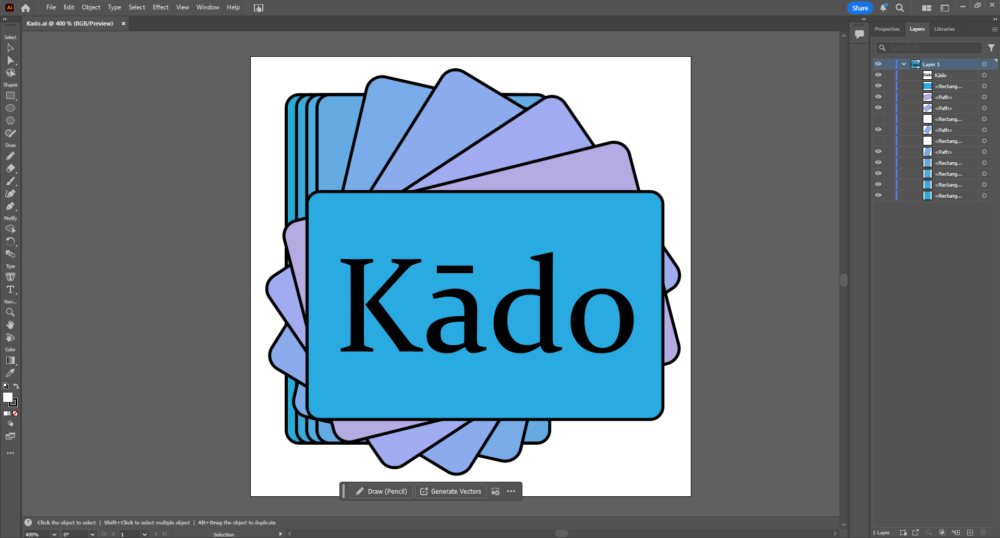
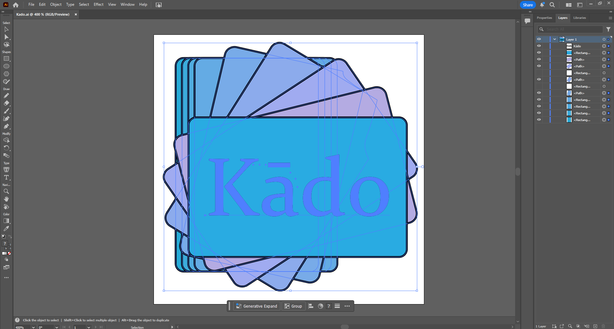

# Logo Production

## Program

I used Adobe Illustrator to create my logo. 

## Ideation & Process

I started off by thinking what constitutes a card app, which led me to the idea of cards *(very insighful I know.)*\
\
As I was making the various cards, I then thought, since the text should be horizontal, it would be good to have a horizontal ending for the series, thus that I made, and quickly chucked a title in, leading to the original export:

I then decided to add some color and change the font to make the second final version:

And I also decided to eliminate the nibbly bits from the left side, resulting in this, the final version of the logo:

